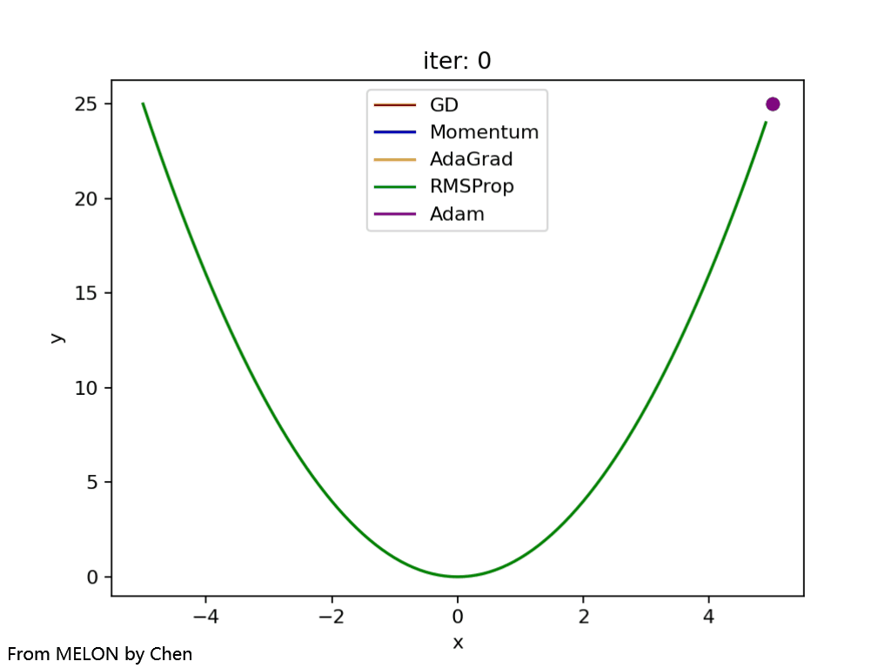
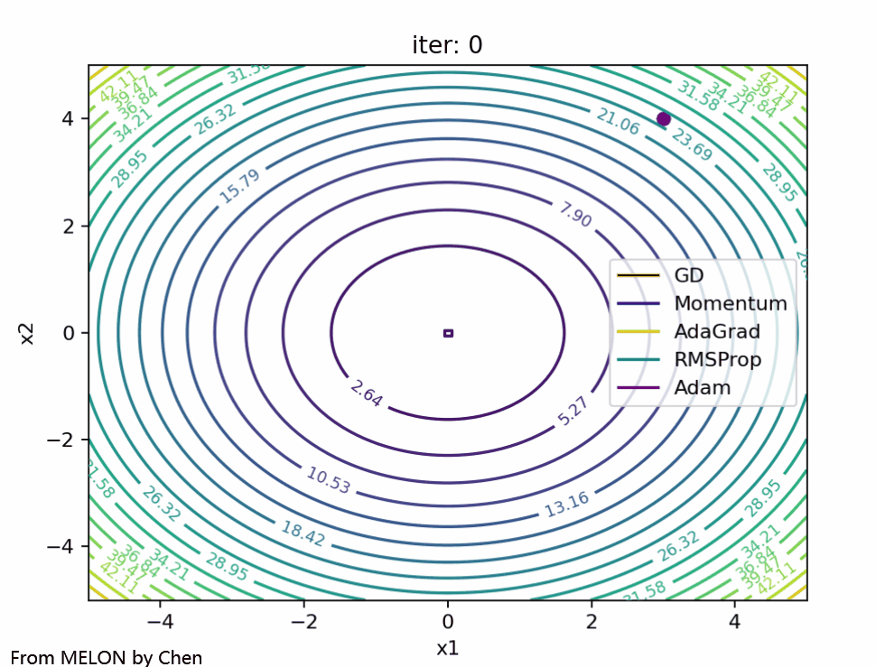
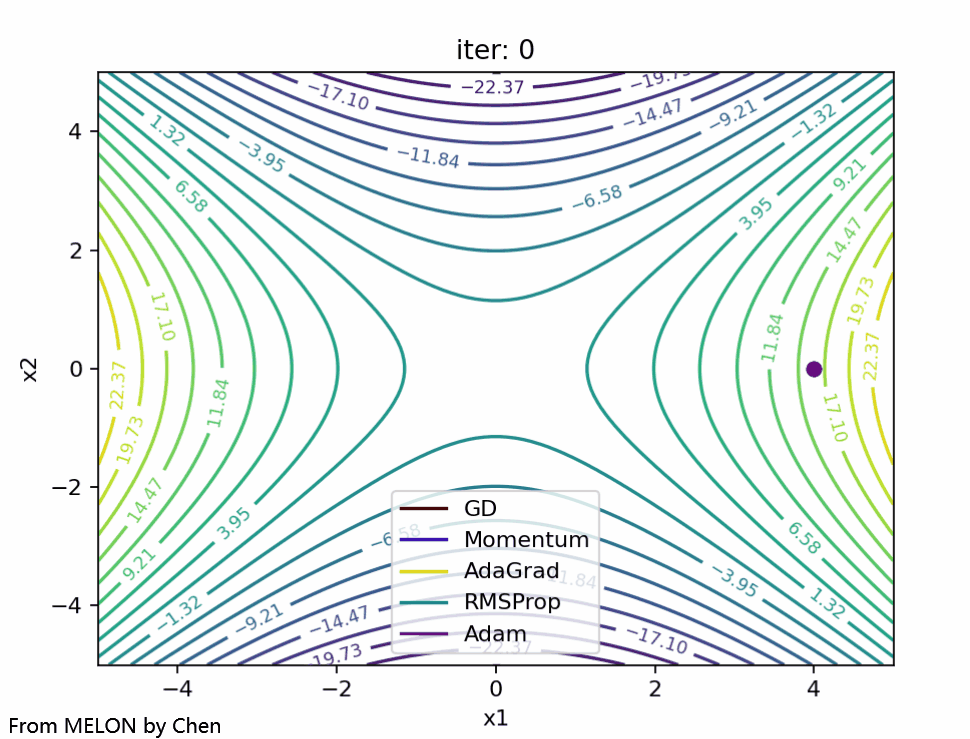
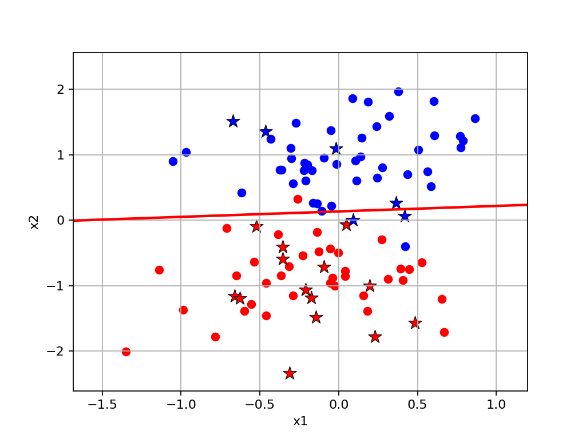

# MELON

## 介绍
基于NumPy构建的机器学习模型 
ChEn's Machine Learning model Organized using Numpy

## 模型说明

### Dataset: 数据集

### Examples: 模型使用示例

### Models: 机器学习模型
- GradientOptimizer: 梯度优化器，为模型中需要使用梯度优化的提供支持
- SupportVectorMachine: 支持向量机，包含支持向量机分类器SVC和支持向量机回归器SVR，以及SMO算法的实现
- DecisionTree: 决策树相关模型，包含决策树分类器和决策树回归器，并实现了树的绘制函数
- Clustering: 聚类相关模型
- DecisionTree: 决策树相关模型
- DimensionReduction: 降维相关模型
- LinearClassifier: 线性分类相关模型
- LinearRegressor: 线性回归相关模型

### Notes: 机器学习笔记和示例

## 安装教程

1.  最好使用 Anaconda 
2. 必要包: `python>=3.6`、`numpy`、`pandas`、`matplotlib`

## 使用说明

- `本代码仅供参考学习和学术研究下载`
- `Copy核心代码时请注明出处`

## 效果展示

### 梯度优化器

- 各类梯度优化算法优化平方函数的表现 
  
- 各类梯度优化算法优化双曲抛物面(马鞍面)函数的表现 
  

### 支持向量机

- 支持向量机分类器使用线性核函数对均匀随机数据和双点状随机数据分类效果 
  
- 支持向量机分类器使用不同伽马值的高斯核函数对同心圆随机数据分类效果 
  

- 支持向量机回归器使用线性核函数对随机线性数据回归效果/使用多项式核函数对随机多项式数据回归效果 
  
- 支持向量机回归器使用高斯核函数对三角函数数据回归效果/对复杂三角函数数据回归效果 
  

### 决策树

- 决策树分类器对均匀随机数据分类效果并绘制树的形状 
  
- 决策树分类器对双点状随机数据和同心圆随机数据的分类效果 
  

- 决策树回归器对随机线性数据和随机多项式数据的回归效果 
  
- 决策树回归器对三角函数数据和对复杂三角函数数据回归效果 
  

### 线性分类器

- Fisher线性判别分类器对均匀随机数据和双点状随机数据分类效果 
  
- 逻辑回归线性分类器对均匀随机数据和双点状随机数据分类效果 
  
- 感知机分类器对均匀随机数据和双点状随机数据分类效果 
  

### 线性回归器

## 参与贡献

Luchen Wang

