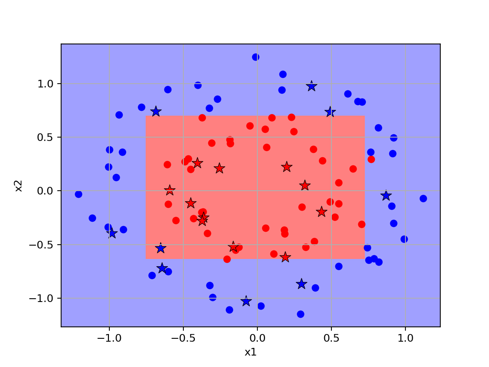
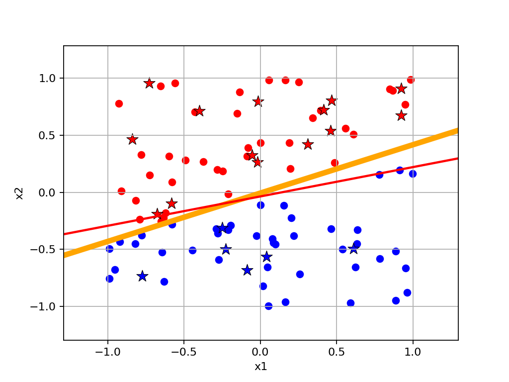

# MELON

## 项目名称
基于NumPy构建的机器学习算法与模型库<br>
Chen's MachinE Learning models Organized using Numpy

## 项目简介

这是一个基于NumPy实现的机器学习算法与模型库，旨在帮助对机器学习感兴趣的伙伴们深入理解机器学习各类算法和模型的底层原理。
为了降低学习门槛，本项目在设计上参考了scikit-learn的API风格，但主要聚焦于核心功能的实现，因此功能相对精简。与成熟的工业级框架不同，本项目更注重算法实现的透明性和可读性，通过手写底层代码来揭示机器学习模型的工作原理。
另外，需要说明的一点是，本项目更适合学习和实验用途，如需用于生产环境，这里推荐使用功能更完善的[scikit-learn](https://scikit-learn.org/)等专业框架。<br>
希望本项目能够帮助感兴趣的伙伴们建立起对机器学习模型与算法的深刻理解，为后续在机器学习与人工智能领域的进一步学习和研究打下坚实的基础。
<br><br>
**特别说明：`本代码仅供参考学习、竞赛和科学研究等非商业用途，在复制核心代码时请注明出处`**

## 安装教程
**1. 建议使用 `Anaconda` 创建 `Python` 环境**<br>
使用 Anaconda 创建环境可以方便地管理依赖包，避免版本冲突。建议从 [Anaconda 官网](https://www.anaconda.com/download/success) 下载并安装 Anaconda。如果需要特定版本，可以访问 [Anaconda所有版本下载地址](https://repo.anaconda.com/archive/)。<br>
安装完成后，运行以下命令创建 Python 环境：
```bash
conda create --name my_env python=3.9
conda activate my_env
```
**注意**：本项目支持 Python 3.7 及以上版本，建议使用 Python 3.9 以获得最佳兼容性。请确保已安装 Python 3.7 或更高版本。<br>
**2. 安装必要包**<br>
本项目依赖以下包: `numpy`、`pandas`、`matplotlib`、`tqdm`、`networkx`。请确保已安装 Python 3.7 或更高版本，运行以下命令一键安装必要包：<br>
```bash
pip install numpy pandas matplotlib tqdm networkx
```

## 模型说明

### Dataset: 数据集

### Examples: 模型使用示例

### Models: 机器学习模型
- GradientOptimizer: 梯度优化器，包含SGD、等梯度优化算法，为模型中需要使用梯度优化的提供支持
- SupportVectorMachine: 支持向量机，包含支持向量机分类器SVC和支持向量机回归器SVR，以及SMO算法的实现
- DecisionTree: 决策树相关模型，包含决策树分类器和决策树回归器，并实现了树的绘制函数
- Clustering: 聚类相关模型，包含K-means、谱聚类、DBSCAN等算法
- DimensionReduction: 降维相关模型，包含PCA主成分分析等算法
- DiscriminantAnalysis: 判别分析相关模型，包含线性判别分析、Fisher判别分析、高斯判别分析等模型
- LinearClassifier: 线性分类相关模型，包含逻辑回归、感知机等模型
- LinearRegressor: 线性回归相关模型，包含普通最小二乘线性回归、岭回归等模型
- MultiClassWrapper: 多分类包装器，包含一对一(OvO)分类包装器和多对多(OvR)分类包装器
- NaiveBayes: 朴素贝叶斯模型，包含高斯朴素贝叶斯等模型
- NeighborsBased: 基于邻居判别和回归的模型，包含K近邻分类与K近邻回归等模型

### Notes: 机器学习笔记和示例

## 更新计划
- [x] 更新项目文档
- [ ] 更新算法笔记
- [x] 加入朴素贝叶斯分类器
- [x] 加入K-近邻算法
- [ ] 加入层次聚类算法
- [ ] 加入牛顿共轭梯度法
- [ ] 加入拟牛顿法
- [ ] 加入梯度提升树相关模型
- [ ] 实现sample_weight参数
- [ ] debug AdaBoostClassifier for nonlinear classification


## 效果展示

### 梯度优化器

- 各类梯度优化算法优化平方函数的表现<br>
 <br/>
- 各类梯度优化算法优化双曲抛物面(马鞍面)函数的表现<br>
 <br/>

### 支持向量机

- 支持向量机分类器使用线性核函数对均匀随机数据和双点状随机数据分类效果<br>
 <br/>
- 支持向量机分类器使用不同伽马值的高斯核函数对同心圆随机数据分类效果<br>
 <br/>

- 支持向量机回归器使用线性核函数对随机线性数据回归效果/使用多项式核函数对随机多项式数据回归效果<br>
 <br/>
- 支持向量机回归器使用高斯核函数对三角函数数据回归效果/对复杂三角函数数据回归效果<br>
 <br/>

### 决策树

- 决策树分类器对均匀随机数据分类效果并绘制树的形状<br>
 <br/>
- 决策树分类器对双点状随机数据和同心圆随机数据的分类效果<br>
 <br/>

- 决策树回归器对随机线性数据和随机多项式数据的回归效果<br>
 <br/>
- 决策树回归器对三角函数数据和对复杂三角函数数据回归效果<br>
 <br/>

### 线性分类器

- Fisher线性判别分类器对均匀随机数据和双点状随机数据分类效果<br>
 <br/>
- 逻辑回归线性分类器对均匀随机数据和双点状随机数据分类效果<br>
 <br/>
- 感知机分类器对均匀随机数据和双点状随机数据分类效果<br>
 <br/>

### 线性回归器
- 待更新


## 参与贡献

**Luchen Wang**<br>
<small>（如在使用过程中遇到任何问题，可随时联系邮箱：wangluchen567@qq.com）</small>


