# 🍉 MELON
💬 Language: [English](README_EN.md) | [中文](README.md)

Chen's MachinE Learning models Organized using Numpy

## 🔖 Project Introduction

This is a machine learning algorithm and model library implemented with NumPy, aimed at helping those interested in machine learning gain a deep understanding of the underlying principles of various machine learning algorithms and models.
To lower the learning barrier, this project references the API style of scikit-learn in its design but focuses on the implementation of core functionalities, resulting in a relatively streamlined feature set. Unlike mature industrial frameworks, this project emphasizes the transparency and readability of algorithm implementation, revealing the working principles of machine learning models through handwritten code.
It should be noted that this project is more suitable for learning and experimental purposes. For production environments, we recommend using more feature-rich professional frameworks such as [scikit-learn](https://scikit-learn.org/).<br>
We hope this project can help interested individuals build a solid understanding of machine learning models and algorithms, laying a strong foundation for further learning and research in the field of machine learning and artificial intelligence.
<br><br>
**Special Note: `This code is for reference only in non-commercial purposes such as learning, competitions, and scientific research. Please acknowledge the source when copying the core code.`**

## 📚 Installation Guide

**1. It is recommended to use `Anaconda` to create a `Python` environment**

Creating an environment with Anaconda allows for convenient package management and avoids version conflicts. It is recommended to download and install Anaconda from the [Anaconda official website](https://www.anaconda.com/download/success). If a specific version is needed, you can visit the [Anaconda archive download page](https://repo.anaconda.com/archive/).
After installation, run the following commands to create a Python environment:

```bash
conda create --name my_env python=3.9
conda activate my_env
```

**2. Install necessary packages**

This project depends on the following packages: `numpy`, `pandas`, `matplotlib`, `tqdm`, and `networkx`. 
Ensure that you have Python 3.7 or higher installed, 
and run the following command to install all necessary packages in one go:

```bash
pip install numpy pandas matplotlib tqdm networkx
```

## 🎯 Core Components

- **GradientOptimizer: Gradient Optimizers**
  - Optimizer: Includes gradient optimization methods such as GD, RMSProp, and Adam

- **SupportVectorMachine: Support Vector Machines**
  - SupportVectorClassifier: Support Vector Machine Classifier
  - SupportVectorRegressor: Support Vector Machine Regressor
  - SequentialMinimalOptimization: Sequential Minimal Optimization algorithm

- **DecisionTree: Decision Trees**
  - DecisionTreeClassifier: Decision Tree Classifier
  - DecisionTreeRegressor: Decision Tree Regressor
  - PlotTree: Decision Tree Visualization

- **Clustering: Clustering Algorithms**
  - KMeans: K-Means Clustering
  - DBSCAN: Density-Based Spatial Clustering of Applications with Noise
  - SpectralClustering: Spectral Clustering

- **DimensionReduction: Dimensionality Reduction Models**
  - PrincipalComponentAnalysis: Principal Component Analysis (PCA)

- **DiscriminantAnalysis: Discriminant Analysis**
  - FisherDiscriminantAnalysis: Fisher Discriminant Analysis
  - GaussianDiscriminantAnalysis: Gaussian Discriminant Analysis
  - LinearDiscriminantAnalysis: Linear Discriminant Analysis

- **LinearClassifier: Linear Classifiers**
  - GDClassifier: Gradient Optimization-based Classifier
  - LogisticRegression: Logistic Regression Classifier
  - Perceptron: Perceptron Classifier
  - RidgeClassifier: Ridge Regression Classifier

- **LinearRegressor: Linear Regressors**
  - GDRegressor: Gradient Optimization-based Regressor
  - LinearRegression: Ordinary Least Squares Linear Regressor
  - Ridge: Ridge Regression Regressor

- **MultiClassWrapper: Multi-Class Wrappers**
  - OneVsOneClassifier: One-vs-One (OvO) Classifier Wrapper
  - OneVsRestClassifier: One-vs-Rest (OvR) Classifier Wrapper

- **NaiveBayes: Naive Bayes Models**
  - GaussianNaiveBayes: Gaussian Naive Bayes

- **NeighborsBased: Neighbors-Based Models**
  - KNeighborsClassifier: K-Nearest Neighbors Classifier
  - KNeighborsRegressor: K-Nearest Neighbors Regressor

- **EnsembleModels: Ensemble Learning Models**
  - AdaBoostClassifier: Adaptive Boosting Classifier
  - AdaBoostRegressor: Adaptive Boosting Regressor
  - BaggingClassifier: Bagging Classifier
  - BaggingRegressor: Bagging Regressor
  - RandomForestClassifier: Random Forest Classifier
  - RandomForestRegressor: Random Forest Regressor
  - GradientBoostingClassifier: Gradient Boosting Classifier
  - GradientBoostingRegressor： Gradient Boosting Regressor


## 📝 Update Plan
- [x] Update project documentation
- [ ] Update algorithm notes
- [x] Add Naive Bayes Classifier
- [x] Add K-Nearest Neighbors algorithm
- [ ] Add hierarchical clustering algorithm
- [ ] Add Newton-Conjugate Gradient method
- [ ] Add Quasi-Newton Gradient method
- [x] Add ensemble learning models
- [x] Add gradient boosting models
- [ ] Implement sample_weight parameter
- [ ] Debug AdaBoostClassifier for nonlinear classification

## 🌈 Effect Demonstration

### Gradient Optimizer

- Performance of various gradient optimization algorithms on the quadratic function<br>
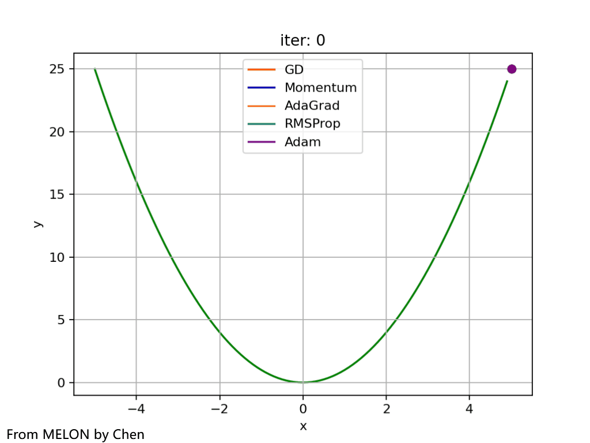 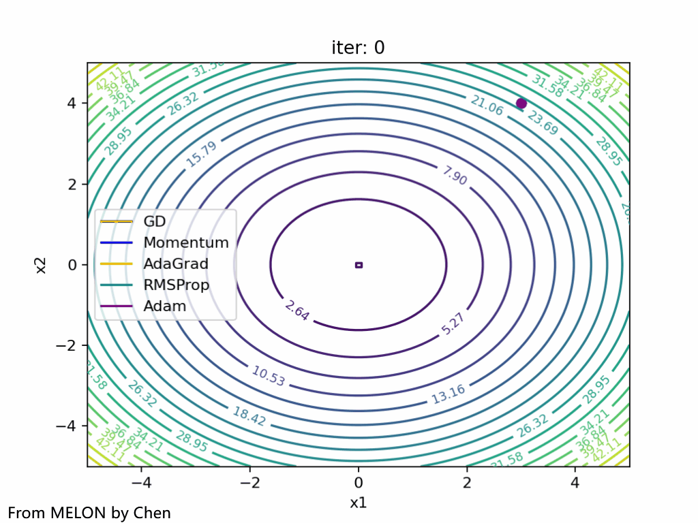<br/>
- Performance of various gradient optimization algorithms on the hyperbolic paraboloid (saddle surface) function<br>
 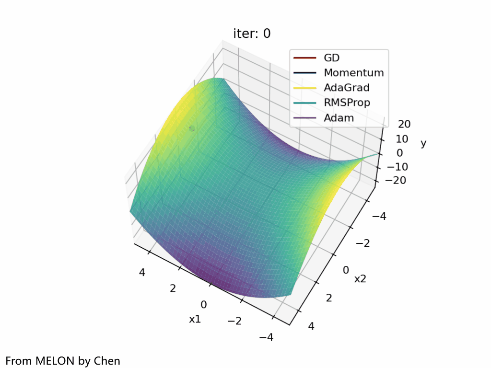<br/>

### Support Vector Machine
- **The principles and formula derivations of the Support Vector Machine Classifier and SMO algorithm can be found in the notes [Support Vector Machine Classifier](./Notes/SupportVectorMachine/SupportVectorClassifier.md)**
- Classification effects of the Support Vector Machine Classifier using a linear kernel on uniform random data and bimodal random data<br>
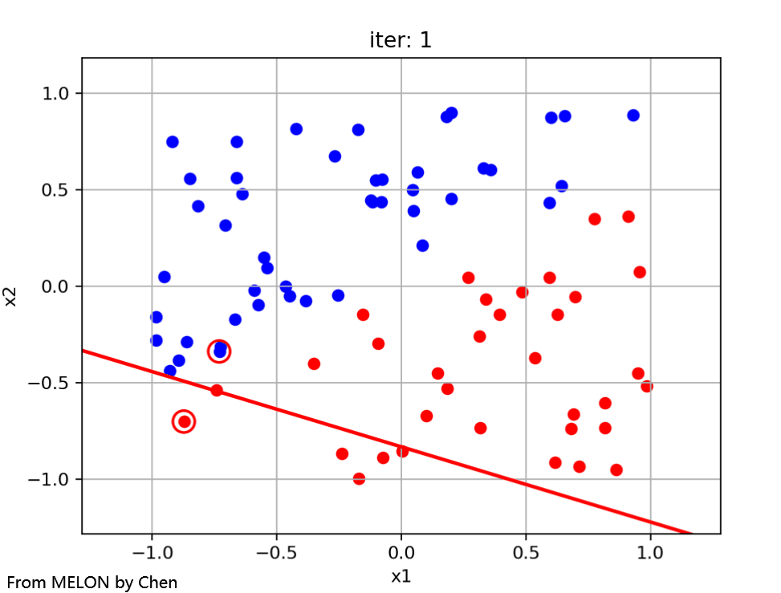 <br/>
- Classification effects of the Support Vector Machine Classifier using Gaussian kernels with different gamma values on concentric circle random data<br>
 <br/>

- **The principles and formula derivations of the Support Vector Machine Regressor and SMO algorithm can be found in the notes [Support Vector Machine Regressor](./Notes/SupportVectorMachine/SupportVectorRegressor.md)**
- Regression effects of the Support Vector Machine Regressor using a linear kernel on random linear data / using a polynomial kernel on random polynomial data<br>
 <br/>
- Regression effects of the Support Vector Machine Regressor using a Gaussian kernel on trigonometric function data / on complex trigonometric function data<br>
 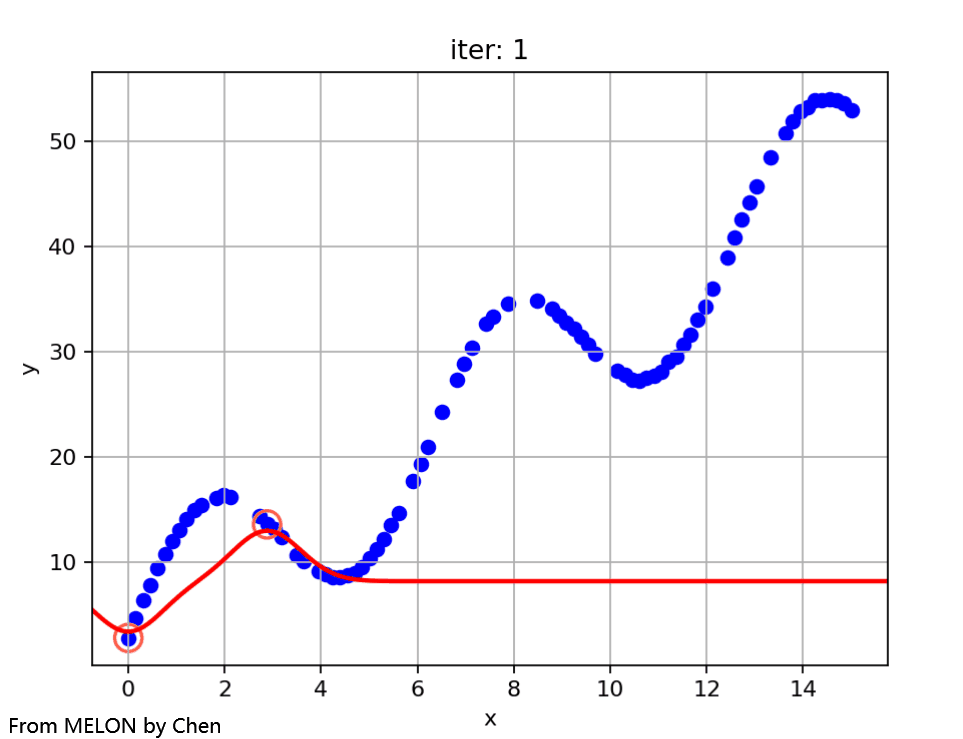<br/>

### Decision Tree

- Classification effect of the Decision Tree Classifier on uniform random data and visualization of the tree structure<br>
 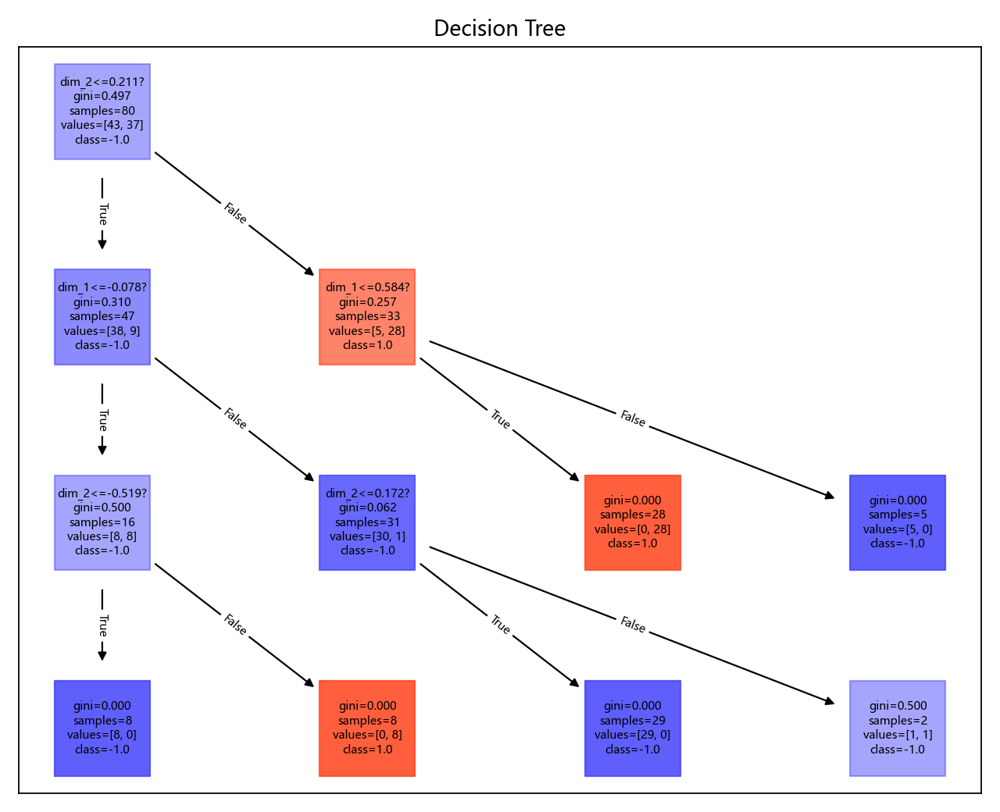<br/>
- Classification effects of the Decision Tree Classifier on bimodal random data and concentric circle random data<br>
 <br/>

- Regression effects of the Decision Tree Regressor on random linear data and random polynomial data<br>
 <br/>
- Regression effects of the Decision Tree Regressor on trigonometric function data and complex trigonometric function data<br>
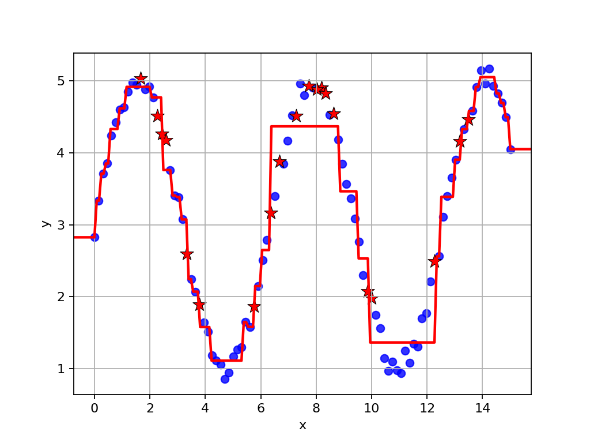 <br/>

### Linear Classifier

- Classification effects of the gradient optimization-based linear classifier on uniform random data and bimodal random data (default hinge loss)<br>
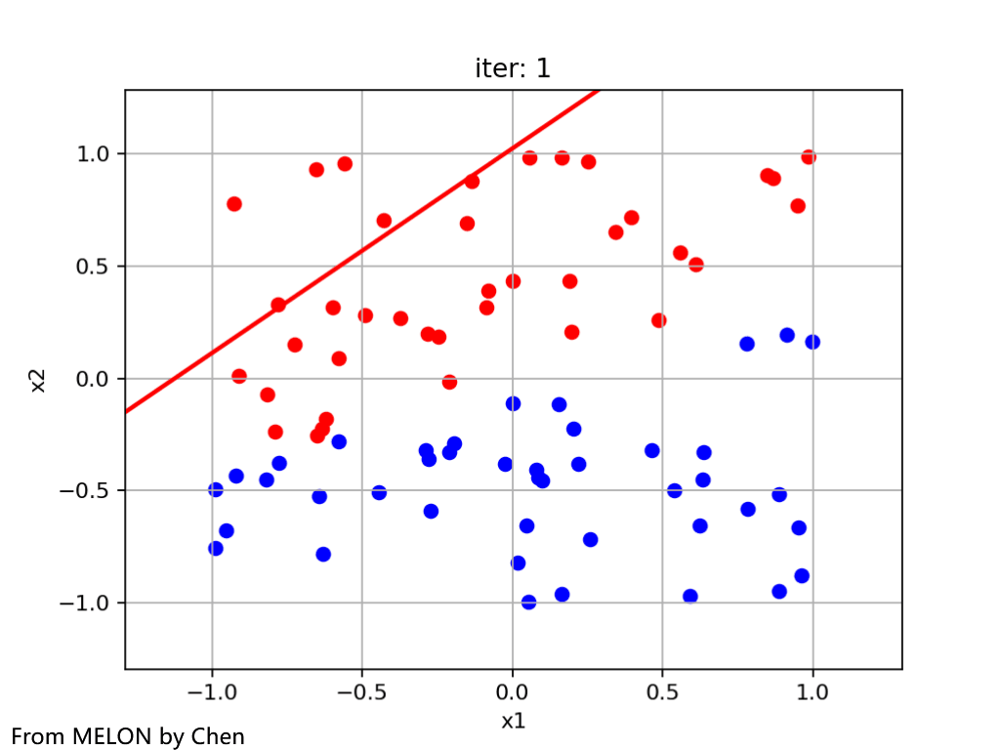 <br/>
- Classification effects of the Logistic Regression Classifier on uniform random data and bimodal random data<br>
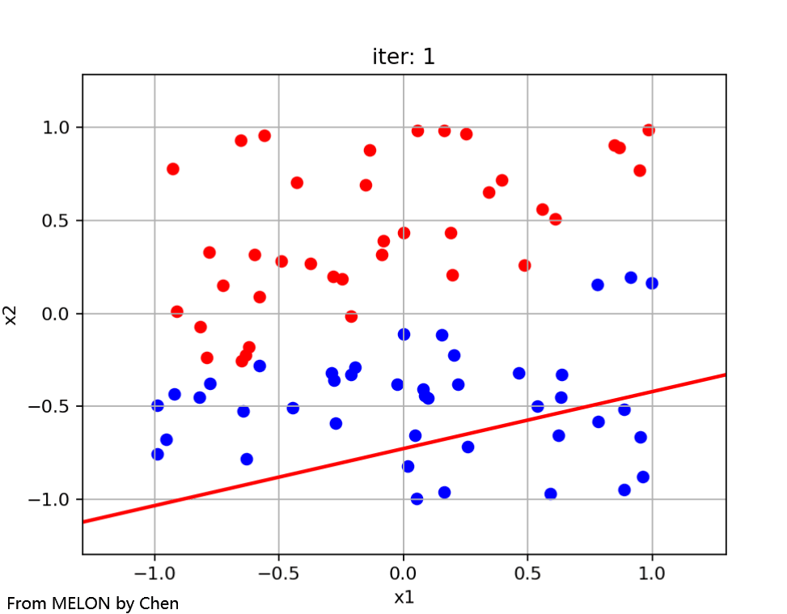 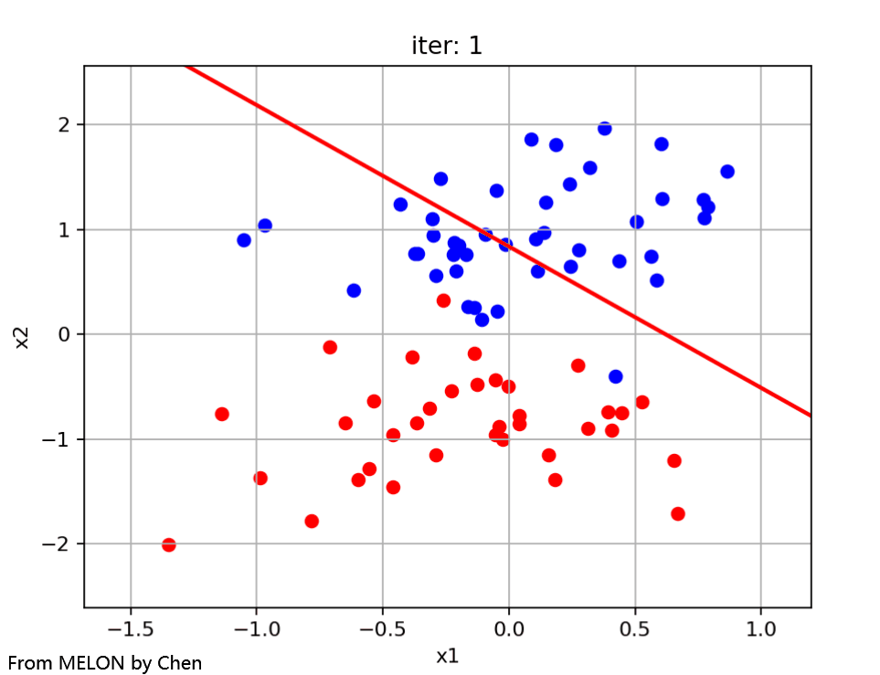<br/>
- Classification effects of the Perceptron Classifier on uniform random data and bimodal random data<br>
 <br/>

### Linear Regressor
- Regression effects of the gradient optimization-based linear regressor and Ridge Regression on linear data<br>
 <br/>

### Clustering Models
- Comparison of clustering effects of K-means, DBSCAN, and spectral clustering<br>
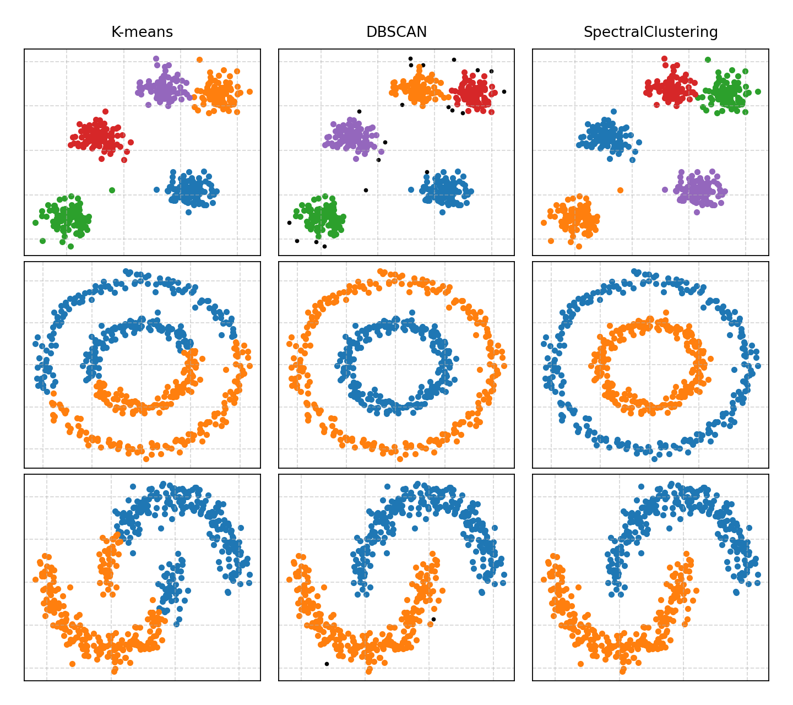<br/>

## 🤝 Contributions

**Author: Luchen Wang**

## ✉️ Contact Us

**E-mail: wangluchen567@qq.com**